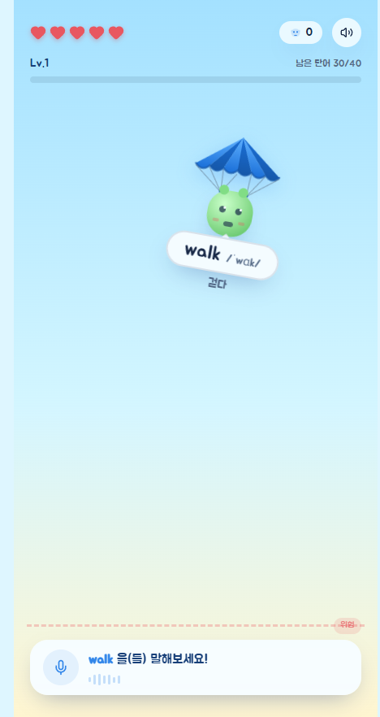

# SpeakFall

Pronounce English words to rescue falling friends in a playful, level-based language learning game.

[](#current-status)

## Overview

SpeakFall (말해봐!영단어 구조대) turns English pronunciation practice into short rescue missions. Learners select a vocabulary track and level, speak the displayed word, and receive immediate game feedback while building a personal word collection and progression record.

**Project Type:** Language Learning Web Application

## Live Demo

A public production demo is not currently documented. The project can be run locally as a web application or packaged as an Android application with Capacitor.

The project is connected to [Lovable](https://lovable.dev/projects/d755d12c-b330-40c7-838d-8112ce3deb2f) for synchronized development.

### Screenshots

<p align="center">
  <a href="docs/screenshots/home.png"></a>
  <a href="docs/screenshots/gameplay.png"></a>
  <a href="docs/screenshots/round-result.png"></a>
</p>

Additional screens are available in the [screenshot gallery](docs/screenshots/).

## Problem

Vocabulary study often emphasizes recognition and memorization while giving learners too few low-pressure opportunities to speak. Conventional pronunciation drills can also feel repetitive, making it difficult to sustain practice and observe progress.

## Solution

SpeakFall combines speech recognition with a rescue-game loop. A learner speaks each target word before the falling character reaches the danger line, receives immediate success or retry feedback, and earns progress, stars, coins, and collectible words through repeated play.

## Key Features

- English speech recognition through the Web Speech API or a native Capacitor plugin
- Easy, normal, and hard recognition difficulty settings
- Six vocabulary tracks: basic, elementary, middle school, high school, business, and professional
- Ten progressive levels per track, with unlock rules and star ratings
- Word collection and review by track and level
- Accuracy, score, combo, rescue count, and best-record summaries
- Locally persisted progress, coins, owned skins, and equipped skin
- Unlockable parachute, umbrella, flower, and balloon cosmetics
- Web/PWA and Android delivery paths
- On-device pre-submission self-test page at `/selftest`
- Privacy information page at `/privacy`

## How It Works

```text
Select Lesson
  ↓
Speech Recording
  ↓
Pronunciation Evaluation
  ↓
Rescue Feedback and Round Result
  ↓
Local Progress, Word Collection, and Rewards
```

1. Choose a recognition difficulty, vocabulary track, and unlocked level.
2. Allow microphone access and pronounce the displayed English word.
3. The browser or native speech-recognition engine returns candidate transcripts.
4. SpeakFall compares the result with the target word and applies the selected tolerance.
5. The round updates health, score, combo, rescued words, stars, coins, and best records.
6. Progress is saved in local storage for the next session.

## Architecture

```text
React UI and TanStack Router
├── Game screens and interaction state
├── Vocabulary tracks and word datasets
├── Speech-recognition abstraction
│   ├── Web Speech API
│   └── Capacitor speech-recognition plugin
├── Game rules, scoring, progress, skins, and sound
├── Browser localStorage persistence
├── Self-test and privacy routes
└── Advertising presentation layer
    ├── Web: AdSense configuration
    └── Native: reserved mobile advertising integration area

Vite / TanStack Start
├── SSR web build
└── Static mobile build → Capacitor → Android project
```

The application keeps gameplay data and progression logic in the client. The current implementation does not document a remote account system or application database. Native Android delivery wraps the generated static web application with Capacitor.

## Tech Stack

| Area                              | Technology                                                |
| --------------------------------- | --------------------------------------------------------- |
| Language                          | TypeScript                                                |
| UI                                | React 19, Tailwind CSS 4, Radix UI                        |
| Routing and application framework | TanStack Router, TanStack Start                           |
| Build tooling                     | Vite 8, Bun                                               |
| Speech recognition                | Web Speech API, `@capacitor-community/speech-recognition` |
| Mobile runtime                    | Capacitor 8, Android Gradle project                       |
| Validation                        | ESLint, Prettier, in-app self-test                        |
| Persistence                       | Browser `localStorage`                                    |
| Web advertising                   | Google AdSense configuration hooks                        |

## Project Structure

```text
SpeakFall/
├── android/                       # Capacitor Android project
├── docs/
│   └── amazon-appstore.md         # Amazon Appstore submission notes
├── public/                        # Icons, manifest, and static web assets
├── src/
│   ├── assets/                    # Game artwork
│   ├── components/
│   │   ├── ads/                   # Web/native advertising presentation
│   │   ├── speakfall/             # Main game UI and skin visuals
│   │   └── ui/                    # Reusable UI primitives
│   ├── data/words/                # Vocabulary datasets by learning track
│   ├── hooks/                     # Speech and responsive UI hooks
│   ├── lib/speakfall/             # Game rules, progress, audio, and self-test
│   └── routes/                    # Game, privacy, and self-test routes
├── capacitor.config.ts            # Native application configuration
├── package.json                   # Scripts and dependencies
└── vite.config.ts                 # Web and mobile build configuration
```

## Current Status

SpeakFall is in pre-release validation for its first store submission.

Implemented in the current codebase:

- Core pronunciation rescue loop and three difficulty settings
- Vocabulary tracks, level progression, word collection, scoring, rewards, and skins
- Browser and Android speech-recognition paths
- Android package configuration for `com.joygle.speakfall`, version `1.0.0` (`versionCode 1`)
- Microphone, storage, audio, safe-area, network, and advertising-area checks on `/selftest`
- Store-submission notes for Amazon Appstore

Still requiring release-device verification:

- Clean installation and launch of the release build
- Microphone permission allow, deny, and re-enable flows
- Recognition quality across representative Android and Fire OS devices
- Layout, safe-area, scrolling, and back-navigation behavior across screen sizes
- Advertising SDK/provider integration and family-policy configuration
- Offline behavior, app resume, interruption, and progress persistence
- Final store metadata, screenshots, feature graphic, signing, and policy declarations

## Getting Started

### Requirements

- [Bun](https://bun.sh/) compatible with the lockfile in this repository
- A current Node.js runtime supported by the project dependencies
- Android Studio and a compatible JDK for Android builds
- A physical device with a microphone for release validation

### Web development

```sh
bun install --frozen-lockfile
bun run dev
```

Open the local URL printed by Vite. Microphone recognition in a browser requires `localhost` or a secure HTTPS context and a supported browser.

Optional web advertising variables:

```env
VITE_ADSENSE_CLIENT=ca-pub-XXXXXXXX
VITE_ADSENSE_SLOT=YYYYYYYYYY
```

If these values are omitted, the application displays a reserved advertising placeholder.

### Production web build

```sh
bun run build
bun run preview
```

### Android development build

```sh
bun run build:android
cd android
./gradlew assembleDebug
```

On Windows PowerShell, run the Gradle wrapper as `./gradlew.bat assembleDebug`.

The debug build does not require a release keystore. If Gradle cannot locate the Android SDK, create the ignored `android/local.properties` file with your local SDK path:

```properties
sdk.dir=/path/to/Android/Sdk
```

### Android release build

Create a local `android/keystore.properties` file containing the release keystore values expected by `android/app/build.gradle`:

```properties
storeFile=absolute-or-relative-path-to-keystore
storePassword=your-store-password
keyAlias=your-key-alias
keyPassword=your-key-password
```

Do not commit the keystore or `keystore.properties`.

```sh
bun run build:android
cd android
./gradlew bundleRelease
```

Use `assembleRelease` instead when a store or testing workflow specifically requires an APK.

## Testing

### Automated source checks

```sh
bun run lint
bun run build
```

The repository currently does not define an application-level unit-test script. The generated Android project includes template JUnit and instrumentation test classes; these do not constitute coverage of SpeakFall gameplay.

Validation baseline recorded on August 9, 2026:

| Check                               | Result             | Notes                                                                                                                  |
| ----------------------------------- | ------------------ | ---------------------------------------------------------------------------------------------------------------------- |
| `bun install --frozen-lockfile`     | Pass               | Dependencies installed from `bun.lock`                                                                                 |
| `bunx prettier --check README.md`   | Pass               | README formatting verified                                                                                             |
| `bun run build`                     | Pass with warnings | Web production build completed; Vite reported a deprecated path-resolution plugin configuration and chunks over 500 kB |
| `bun run build:android`             | Pass with warnings | Mobile web build and Capacitor Android synchronization completed; chunk-size warning remains                           |
| `bun run lint`                      | Fail               | 6,085 existing issues, primarily Prettier violations and explicit `any` usage                                          |
| `android/gradlew.bat assembleDebug` | Pass               | Debug APK generated without a release keystore                                                                         |

Treat the lint failure as a release blocker. Re-run the full baseline after correcting it and update this table with the new results.

### Installed-app self-test

1. Build and install the intended release candidate on a physical device.
2. Open `/selftest` within the installed application.
3. Run the automatic checks and confirm that no unexpected failures are reported.
4. Run the interactive microphone permission and microphone input checks.
5. Copy the generated report and attach it to the release verification record.

The self-test covers:

- Runtime and viewport information
- Secure execution context
- Microphone permission state and permission request
- Live microphone input signal
- Availability of the speech-recognition engine
- Web Audio output capability
- Local-storage read/write behavior
- Advertising-area layout
- Safe-area inset handling
- Online/offline state

### Manual release checklist

- [ ] Install the release candidate on a clean device.
- [ ] Confirm the app name, icon, splash screen, portrait orientation, and first launch.
- [ ] Test microphone permission allowed, denied, denied permanently, and restored in Settings.
- [ ] Complete at least one successful and one failed pronunciation attempt at each difficulty.
- [ ] Verify health, danger line, score, combo, accuracy, stars, coins, and rescued-word counts.
- [ ] Complete a level and confirm that the next eligible level unlocks.
- [ ] Close and reopen the app; confirm that progress and the equipped skin persist.
- [ ] Purchase and equip a skin; confirm the balance and ownership state remain correct.
- [ ] Verify the word book and all populated vocabulary tracks.
- [ ] Test system back navigation, background/resume, audio interruption, and loss of network.
- [ ] Inspect small and large screens for clipping, safe-area overlap, and inaccessible controls.
- [ ] Confirm that advertising content does not cover gameplay or navigation.
- [ ] Review `/privacy` and store declarations against actual microphone, network, storage, and advertising behavior.
- [ ] Run `/selftest`, save its report, and record the device model, OS version, build type, and result.

## CI/CD

No repository CI workflow is present in the current project snapshot. Before release, add a workflow that installs the frozen Bun lockfile and runs lint and production builds for pull requests and the release branch.

Changes pushed to the connected branch synchronize with Lovable. Avoid force-pushing, rebasing, amending, or squashing commits that have already been published because rewriting history can remove Lovable project history.

## Documentation

- [Amazon Appstore submission notes](docs/amazon-appstore.md)
- [Privacy Policy](https://kbyunghak.github.io/JOYgleStudio/privacy/speakfall/en)
- [Pre-submission self-test source](src/routes/selftest.tsx) — run the application and open `/selftest` to use the interactive checks
- [Shared README standard](https://github.com/kbyunghak/Portfolio/blob/master/docs/README_STANDARD.md)
- [Shared commit standard](https://github.com/kbyunghak/Portfolio/blob/master/docs/COMMIT_STANDARD.md)

Documentation-only commits should follow the shared format, for example: `docs: align README with shared standard`.

## Roadmap

- Complete physical-device and Fire OS compatibility testing
- Add application-level automated tests for pronunciation matching and progression rules
- Add CI checks for linting, web builds, and Android packaging
- Finalize the native advertising provider and compliance configuration
- Complete Google Play and Amazon Appstore submission assets and declarations
- Document supported devices, browsers, and verified recognition environments

## Limitations

- Speech-recognition availability and accuracy depend on the browser, operating system, installed recognition service, microphone quality, accent, and surrounding noise.
- A browser build requires a supported Web Speech API implementation and a secure context for microphone access.
- Progress is stored locally and may be lost when application data or browser storage is cleared.
- No cloud synchronization or user-account recovery path is documented in the current implementation.
- Native advertising integration is not yet documented as release-ready.
- The current repository does not yet include an automated CI workflow; release checks must be run locally until CI is added.

## License

This project is licensed under the [MIT License](LICENSE).
